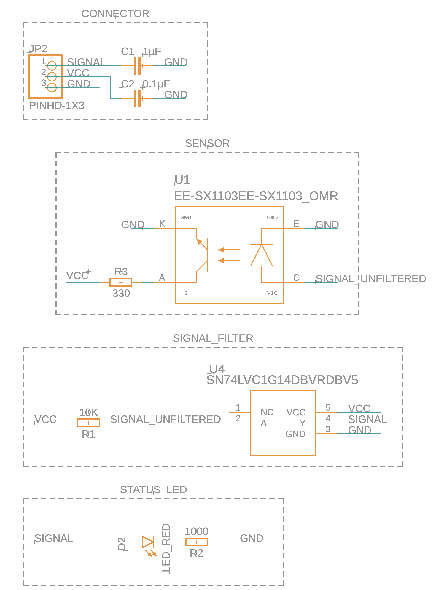
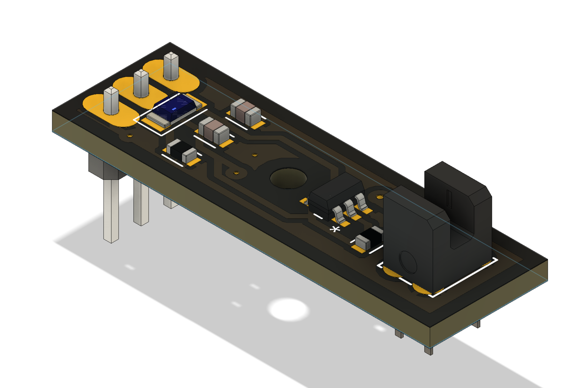
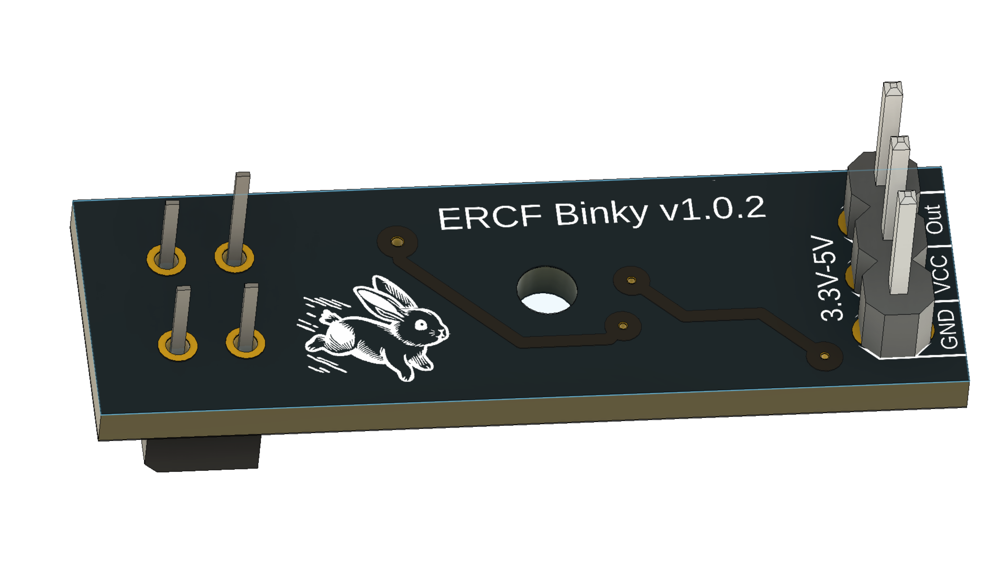
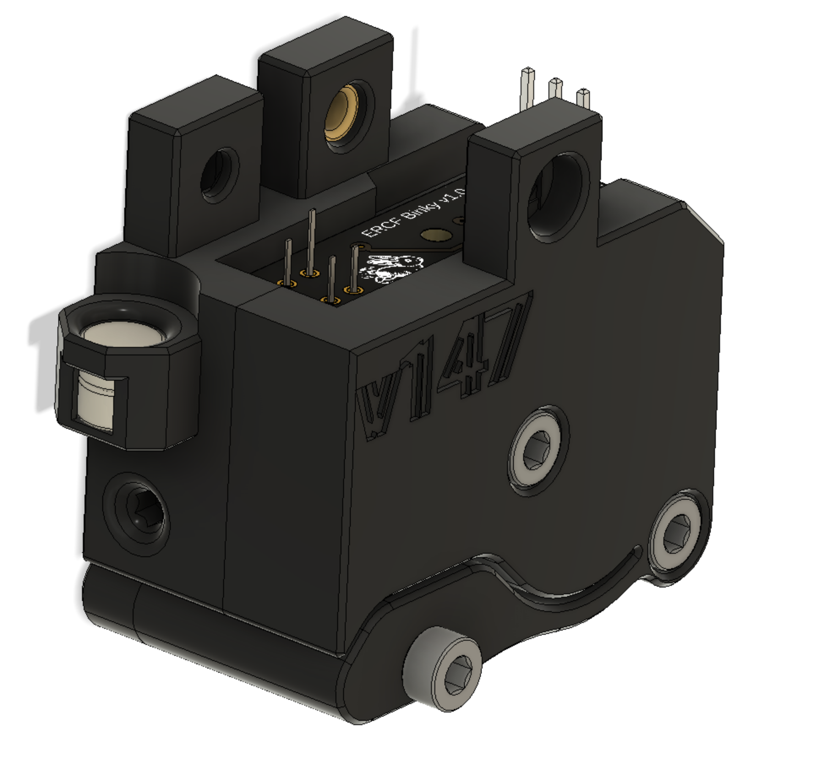
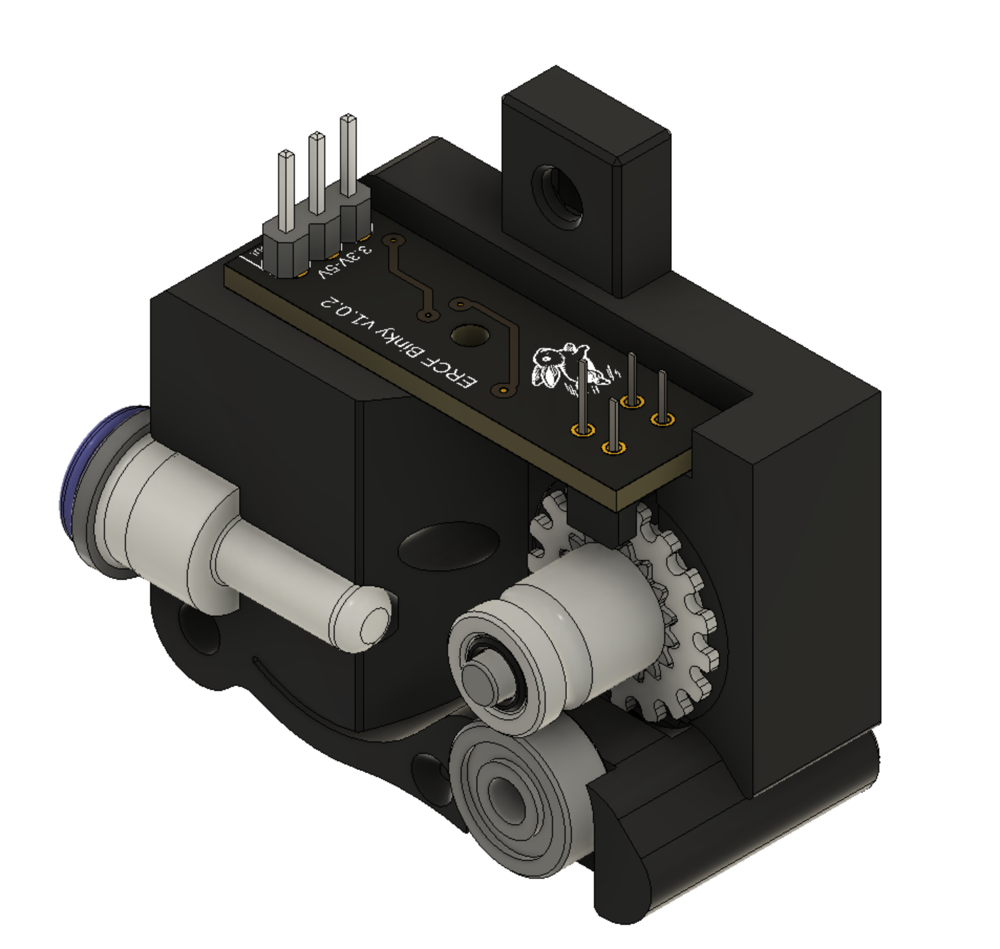
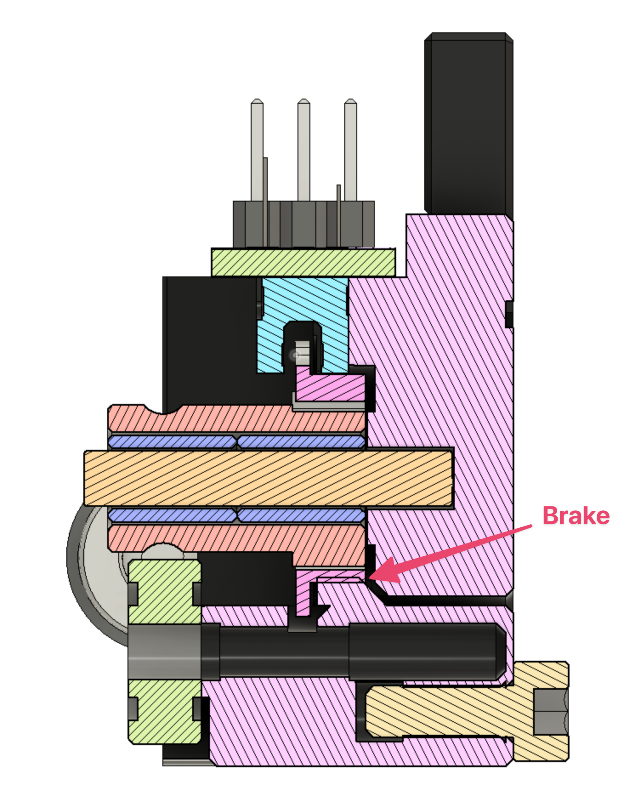

# ERCF Binky Encoder

The original Filament Encoder of ERCF based on the [TCRT5000 PCBs](Images/TCRT5000.jpg) is working for some people but is also creating headaches for lots of other people and also makes up quite a good amount of support questions on discord.
I gave up getting it to work properly after ~10h and instead started to experiment with a different kind of sensor that uses a slotted wheel instead.
First i tried a readily available [KY-010](https://www.google.com/search?q=ky-010) but sadly that board does not have any
filtering which causes fales pulses on the "edge".
So instead i created a new PCB based on the same small Omron sensor that is used on the KY-010 board, the [EE-SX398](https://omronfs.omron.com/en_US/ecb/products/pdf/en-ee_sx398_498.pdf).
It's tiny, reliable and cheap, so i combined it onto a PCB with a schmitt filter to filter out false edge readings and also added a led like the TCRT5000 boards.

### Binky Definition

noun, plural bin·kies. 
the playful twisting leap that a rabbit makes, usually with a 180–turn in midair.

### Binky Schematic and PCB

### Encoder

The encoder itself is a drop in replacement for the old one, you can simply replace the old encoder with this new version, including the 3 pin cable.

Internally it uses a 3D printed slotted wheel, that's pressed on the bondtech gear which then cuts blocks the light of the EE-SX398 when the filament moves.
The slotted wheel has the same amount of slots, so that it's compatible with the old software values based on the TCRT5000.
Aside from the ERCF_CALIBRATE_ENCODER Macro no changes to the software are needed.

Here's a crosscut view that also shows a small additional feature, there is a "brake" that stops the bondtech gear when no filament is present, so that the bondtech gear doesn't keep spinning when rapidly ejecting the filament on unload.

### BOM

The BOM is the same as the OLD encoder aside from a M2x10 self tapping screw for plastic instead of the M3x8SHCS to fasten the PCB
